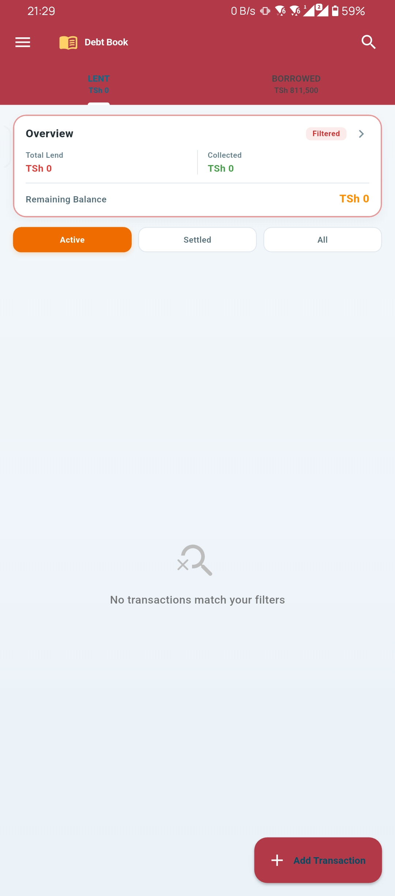
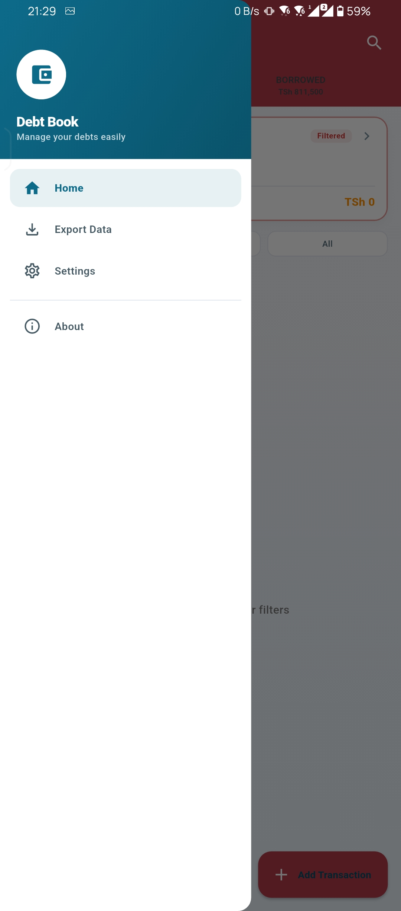
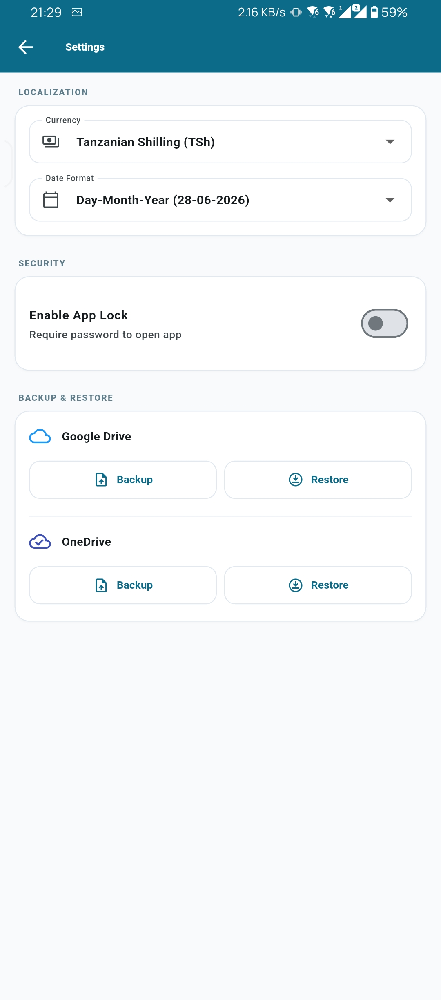
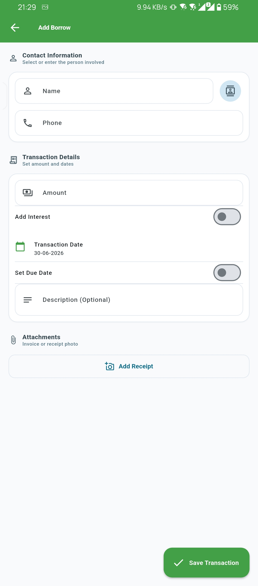
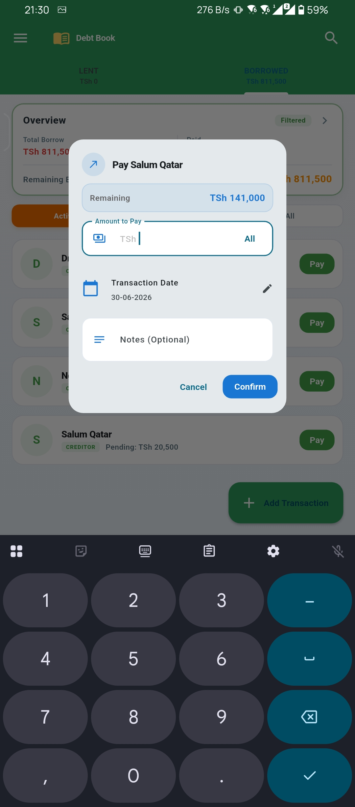

# Debt Book

Debt Book is a Flutter app for tracking money you have lent out and money you have borrowed. It focuses on active balances, partial payments, transaction history, and simple offline record keeping.

## Project Info

- This project was almost entirely developed by using AI as a side project
- Developer: IntroSoft Media Solutions
- Contact: msr08@live.com

## Features

- Track both lent and borrowed transactions in separate tabs.
- Show active outstanding balances at the tab headers.
- Record partial payments with payment date and optional note.
- Increase an existing debt with Borrow More and Lend More actions.
- Mark transactions as settled automatically when paid in full.
- Search transactions quickly and filter by status.
- Sort records by date, amount, or name.
- View transaction details, including activity history.
- Attach a receipt or invoice image to a transaction.
- Pick a person from device contacts when creating or editing a record.
- Export filtered records to Excel and PDF.
- Back up and restore the local database.
- Configure currency and date format.
- Protect the app with a password lock.

## Tech Stack

- Flutter
- Dart
- Provider for state management
- SQLite via `sqflite` for local persistence
- `shared_preferences` for app settings and lock state
- `flutter_contacts` for contact picking
- `image_picker` for receipt or invoice attachments
- `excel` and `pdf` for exports
- `file_selector` and `open_file` for file operations

## How It Works

The app stores debt records locally on the device. Each transaction keeps:

- Person name and phone number
- Transaction type: lend or borrow
- Total amount and paid amount
- Start date and optional due date
- Notes and optional image attachment
- Activity history for create, update, add-more, and payment events

Active totals are calculated from the remaining balance:

- `remaining = amount - paidAmount`

Settled transactions are kept in history but excluded from active outstanding totals.


## SCREENSHOTS







## Project Structure

```text
lib/
	main.dart
	models/
	providers/
	screens/
	services/
	widgets/
test/
```

Main areas:

- `lib/screens/` contains app flows such as home, add/update transaction, export, settings, and transaction details.
- `lib/providers/` contains state and settings management.
- `lib/services/` contains database and export logic.
- `lib/widgets/` contains reusable UI pieces like cards, filters, dialogs, and the drawer.

## Getting Started

### Prerequisites

- Flutter SDK 3.x
- Dart SDK compatible with the Flutter version in this project
- Android Studio or VS Code with Flutter tooling
- An Android emulator, iOS simulator, or physical device

### Install Dependencies

```bash
flutter pub get
```

### Run the App

```bash
flutter run
```

### Run Tests

```bash
flutter test
```

## Configuration Notes

- The app version is defined in `pubspec.yaml`.
- Currency and date format are configurable from the Settings screen.
- App lock settings are stored locally using `shared_preferences`.
- Debt records are stored in a local SQLite database named `debt_book.db`.

## Export and Backup

### Export

The Export screen supports:

- Excel export for filtered records
- PDF export for filtered records
- Filtering by status: Active and Settled
- Filtering by type: Lend and Borrow

Generated reports include totals based on remaining balances.

### Backup and Restore

From Settings, users can:

- Save a copy of the local database to a selected folder
- Restore data from an existing backup file

## Usage Notes

- Use the `LENT` tab for money other people owe you.
- Use the `BORROWED` tab for money you owe other people.
- Use `Collect` or `Pay` on a card to record a payment.
- Use `Details` to inspect notes, attachments, and full activity history.
- Use `Update` to edit transaction information.

Keyboard shortcuts supported in the home screen:

- `Ctrl+F` opens search
- `Ctrl+N` opens the add transaction flow for the current tab

## Permissions

Depending on platform and feature usage, the app may request access to:

- Contacts, for selecting people from the address book
- Camera or gallery, for attaching receipts or invoices
- File access, for backup, restore, and export workflows

## Development Notes

- The app is currently offline-first and does not require a backend.
- State updates are handled through Provider.
- The database schema includes debt history tracking for auditability.

## License

No license file is currently included in this repository. Add one if you plan to distribute the project.
